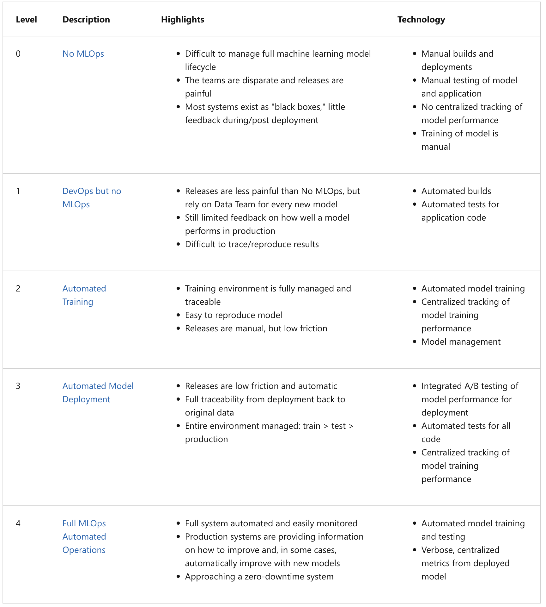

# MLOps Zoomcamp Week 1  

The course begins with a recap about Machine Learning as well as basics about MLOps maturity model.  

Different levels of model maturity:  
1. No Automation  
  - All code is present in a jupyter notebook written by data scientists working alone. Data scientists work in isolation, and the process is prone to disaster when transitioning from experimentation to production. The notebook is handed over to engineer for implementation. There is no automation, pipelining or experiment tracking involved.
2. DevOps, no MLOps  
  -  This introduces some automation, with experienced developers assisting data scientists. Releases are automated. Model can be deployed similar to deploying a web service. Practices like automated releases, unit tests, and integration tests are used but they are not ML-specific. Operational metrics such as how many requests per second come handy in assessing a network situation. There is no experiment tracking and reproducibility of the models. This level is suitable for proof of concept (POC) projects going to production.
3. Automated Training  
    - There are automated machine learning training pipeline where jupyter notebooks are not needed to be loaded and executed to get the models. Model regsistry helps in experiment tracking (particularly the parameters) and knowing the models in production. The training is completely automated. Deployment is not necessarily automated but is low friction. Data scientists work closely with engineers at this stage.
4. Automated Deployment
    - The stage suggests easy deployment of trained models and also involves A/B testing to compare different versions of a model. The models are available on an ML platform, and deployment can be part of the training pipeline.
5. Full MLOps automated operations
    - The whole system is fully automated and easily monitored.

The importance of choosing the right level is based on the number of models in production and the use cases. It's suggested to invest in infrastructure for machine learning processes when there are multiple proven use cases.  

